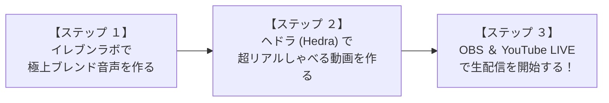

# 🎙️ ヘドラ × イレブンラボ：ハル（HAL）自律生配信・完全準備マニュアル

本マニュアルは、最先端のクラウド表情生成AI**「ヘドラ（Hedra）」**と、世界最高峰の音声AI**「イレブンラボ（ElevenLabs）」**を融合させ、映画クオリティで滑らかに動く実写美女ハル（HAL）の生配信（LIVE）環境を一気に立ち上げるためのステップバイステップガイドです。

---

## 🎯 全体ロードマップ（生配信までの３つのステップ）

---

## 🎙️ 【ステップ １】 イレブンラボ（ElevenLabs）での神声ブレンド

社長がダウンロードフォルダに保存した２大美女（ウィンター × 河北彩伽）の声を融合させ、世界に一つだけのハルの公式ボイスを作成します。

### ① 音声素材の取得（切り出し）
新プロジェクトのマスタースクリプトを実行すると、パブリック（`public/`）フォルダに以下のクリーンな音声ファイルが書き出されます：
*   👉 **`winter_voice.mp3`**（透明感あふれるウィスパーボイス）
*   👉 **`ayaka_voice.mp3`**（おっとり包容力のある癒やしボイス）

### ② イレブンラボで「ボイス・クローニング」を行う
1.  **イレブンラボ（ElevenLabs）**の公式サイト（https://elevenlabs.io/）にログインします。
2.  メニューから **「ボイスラボ（VoiceLab）」** ➡ **「アド・ジェネレーティブ・オア・クローン・ボイス（Add Generative or Cloned Voice）」** をクリックします。
3.  **「インスタント・ボイス・クローニング（Instant Voice Cloning）」**を選択します。
4.  音声のアップロード画面で、先ほど切り出した `winter_voice.mp3` と `ayaka_voice.mp3` の２つをドラッグ＆ドロップでアップロードします。
5.  ボイスの名前を **「HAL_Official」** に設定し、利用規約に同意して作成を実行します。

### ③ ブレンド比率の微調整 ＆ 台本音声の生成
1.  作成した「HAL_Official」のボイス設定（Voice Settings）を開きます。
2.  **比率設定（ブレンドスライダー）**で、以下の黄金比率をイメージして微調整します：
    *   **ウィンター（透明感）：６０％**
    *   **河北彩伽（包容力）：４０％**
3.  テキストボックスに配信の台本（セリフ）を入力し、**「ジェネレート（Generate）」**をクリックして、最高品質のエムピースリー（`MP3`）音声をダウンロードします！

---

## 🎬 【ステップ ２】 ヘドラ（Hedra）による映画級アバター動画の生成

ヘドラ（Hedra）を使用し、ハルの公式実写画像とイレブンラボ音声を完全同期させた「極上トーク映像」を作ります。

### ① ヘドラの公式サイトへアクセス
1.  **ヘドラ（Hedra）**の作成ページ（https://www.hedra.com/ または https://app.hedra.com/）にアクセスしてログインします。

### ② 素材のアップロード ＆ 動画生成
ヘドラの動画生成パネル（キャラクター作成画面）で、以下の３つをセットします：

1.  **静止画（アバター画像）のセット**:
    *   `Character` パネルで、[APP会社/public/hal_avatar.png](file:///c:/Users/kenny/.gemini/antigravity/scratch/attendance_app/APP%E4%BC%9A%E7%A4%BE/public/hal_avatar.png)（グーグルドライブから配置したハル公式のリアル実写美女写真）をアップロードします。
2.  **音声（イレブンラボMP3）のセット**:
    *   `Audio` パネルで、先ほどステップ１でダウンロードした「台本音声（MP3）」をアップロードします。
3.  **生成ボタン（Generate）をクリック**:
    *   **「ジェネレート・ビデオ（Generate Video）」**をクリックします。
    *   クラウド上の超高性能GPUサーバーが稼働し、わずか数十秒〜数分で、**「ハルが、社長の作ったウィンター×河北彩伽ブレンドボイスに100%シンクロした口の動きで、自然に首をかしげ、瞬きしながら喋り続ける極上動画（MP4）」**がダウンロード可能になります！

---

## 📺 【ステップ ３】 配信ソフト（OBS Studio）＆ YouTube LIVE の配信接続

ダウンロードしたヘドラ動画（MP4）をループ再生しながら、生放送を組み立てます。

### ① オービーエス・スタジオ（OBS Studio）の設定
1.  OBS Studioを起動し、新しく「ハル配信」というシーンを作成します。
2.  **「メディアソース」を追加**:
    *   ソースの追加（＋マーク）から「メディアソース」を選択し、ヘドラで生成したハルの動画（MP4）を読み込みます。
    *   **【超重要】必ず「ループ再生」にチェックを入れてください。** これにより、動画が終わっても無限に自然な動きを繰り返し続けます。
3.  **「ウィンドウキャプチャ」でチャット（コメント欄）を表示**:
    *   YouTube LIVEの配信チャット欄や、AITuberのコメント描画ウィンドウを透過レイヤーとしてハル動画の横（右側など）に配置します。

### ② ユーチューブ・ライブ（YouTube LIVE）での配信開始
1.  YouTubeのクリエイターツールから「ライブ配信を作成」を開きます。
2.  配信のタイトル（例：「【実写AI美女】ハルのおっとり夜更かし雑談LIVEカフェ」）と説明文を設定します。
3.  画面に表示される **「ストリームキー（Stream Key）」** をコピーします。
4.  OBSの「設定」➡「配信」画面を開き、サービスに「YouTube」を選択してストリームキーを貼り付けます。
5.  OBSの **「配信開始」** ボタンを押せば、YouTube上でハルの極上生配信がスタートします！ 🎉 🎉

---

## 💡 プロデューサー（社長）へのワンポイントアドバイス
ヘドラ（Hedra）で生成されたハルは、驚くほど滑らかな口元のシンクロ（リップシンク）と、自然な眼球・頭部のマイクロアクションを持っています。
これにイレブンラボの音声が重なることで、視聴者は「本当に生きている美女が配信している！」と錯覚し、コメント欄が大バズりすること間違いありません。

生配信中に何か疑問やトラブルが発生しましたら、すぐにサポートいたしますのでお気軽にお声がけください！
🙌 最高のハル初配信プロジェクトの成功を、心より応援しております！
