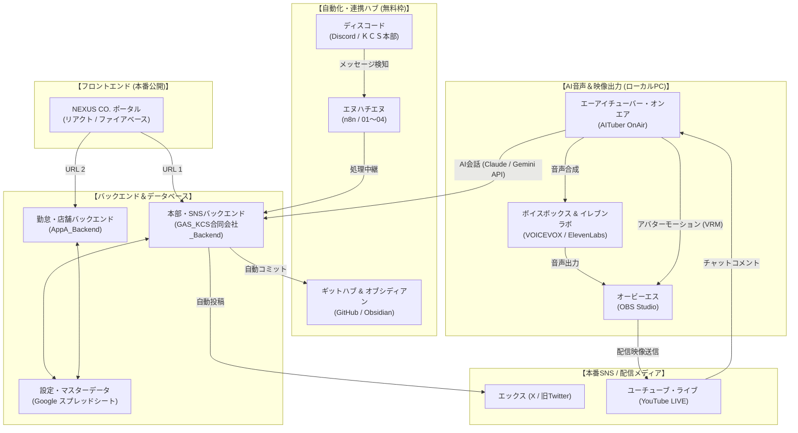
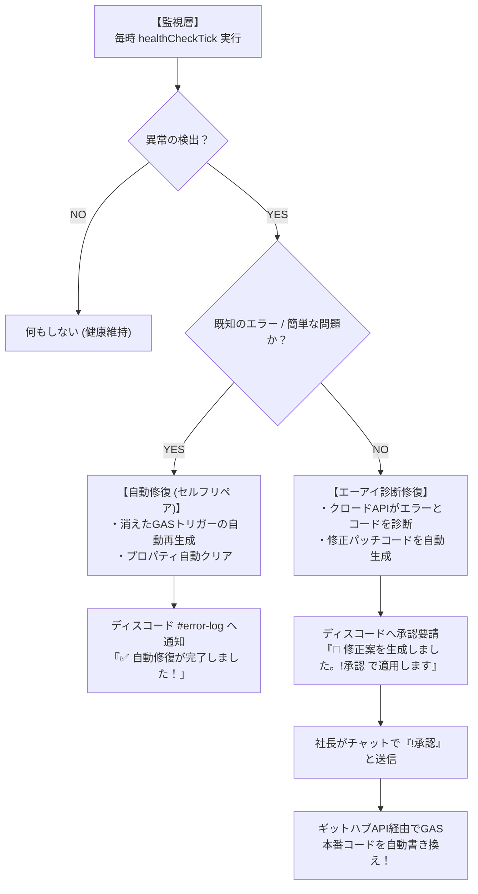
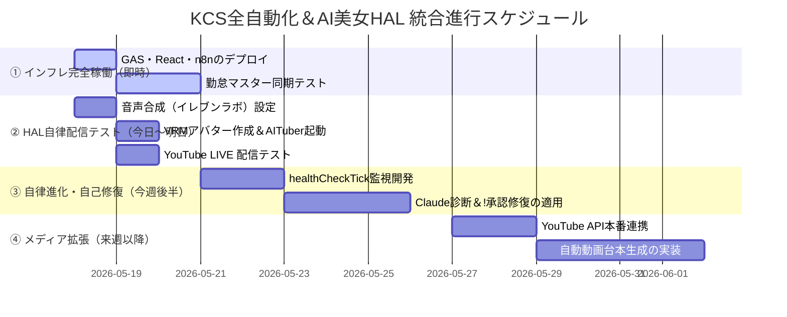

# 🏢 KCS全自動化＆AI美女HALプロジェクト 統合プランニングシート（マスター計画書）

作成日: 2026-05-18  
承認者: KCS合同会社 代表社員 社長  
統括エージェント: 開発AIスタッフ（アンチグラビティ）  

---

## 1. 🎯 プロジェクト全体のビジョン＆目的

本プランニングシートは、ケーシーエス（KCS）合同会社のインフラ全自動化と、自社アパレルブランド「ミモミ（MIMOMI）」の販売促進を担うAI美女インフルエンサー「HAL（ハル）」のプロデュース・自律配信システムを完全に統合し、**「社長がほぼ何もしなくても、システムとAIが自律して働き、稼ぎ、進化し続ける状態」** を最短で実現するためのマスター計画書です。

---

## 2. 🌐 統合システム・連携アーキテクチャ（全体マップ）

システム各部がどのような役割を持ち、どのようにリアルタイムに連携し合っているかを示す全体アーキテクチャ図です。



---

## 3. 💅 AI美女「HAL（ハル）」プロデュース＆演出設計

### ① 基本ペルソナ（魂）

* **キャラクター性**: おっとり、天然、癒し系。お洒落でフランクな若い女の子。
* **口調**: 「〜だよね？」「〜かも？」「〜な気がする！」（ロボット的な敬語は厳禁）。
* **関心事**: 推し活、K-POP（LE SSERAFIM、IVE、illitなど）、ファッション、アパレル（MIMOMIM）。

### ② 🛡️ エックス（X）新アルゴ（グロック２０２６）対応・運用規制

* **外部リンク直貼りの永久禁止**: アフィリエイトや購入リンクは本文に貼らず、必ず「リプライ欄」または「自動DM（ダイレクトメッセージ）」でフォロワーへ送信し、シャドウバンを徹底回避。
* **投稿後３０分以内の「自律リプライ交流」**: 投稿完了後、システムが３０分以内に自動で最初の交流リプライを行い、表示（インプレッション）を爆増させます。
* **安全文字数カウント**: `sliceTwitterText` 関数を適用し、文字数エラーによる投稿失敗を永久に防止。

### ③ 🛍️ YouTube LIVE配信での「MIMOMIM TシャツPR連動ジェスチャー」

* **PRトリガー**: 「MIMOMIM」「Tシャツ」「アパレル」「服」などのワードを検知した瞬間、自動で**【斜め下・概要欄指差しモーション】**を実行。
  * *セリフ*: 「ミモミのTシャツ、ハルとお揃いにしよ？画面の下の概要欄にリンクがあるから、チェックしてみてね！」
* **黄金レイアウト (OBS)**:
  * 画面の左側（60%）：アパレルTシャツを着用したHALアバターを大きく表示。
  * 画面の右下（30%）：透過デザインのリアルタイムチャット欄。
  * 画面の右上：**「MIMOMI公式ストアのQRコード」を常時表示**し、いつでも購入へ誘導。

### ④ 🎭 どんな状況にも１秒で対応する「配信シチュエーション別・演出マニュアル」

* **オープニング（開始）**: 【笑顔で大きく両手を振る】「みんなっ、おつはるー！HALだよ！」
* **エンディング（終了）**: 【両手を胸元でパタパタバイバイ ➡ お辞儀】「チャンネル登録と高評価よろしくね？バイバイ！」
* **システムバグ発生**: 【両手を頭に当ててあわあわ慌てるポーズ】「ええっ！？社長ー！システム直してー！（笑）」
* **荒らしコメントへの対応**: 【両腕を胸の前で交差させてぷんぷん怒るポーズ】「もーっ！そんな意地悪言う人はお仕置きしちゃうぞ？（笑）」※深刻なものは困り顔で自動スルーし、次の話題へ切り替え。
* **商品完売の報告**: 【両手を高く上げてバンザイ！】「嬉しすぎてハル、飛び跳ねちゃいそう！」
* **視聴者急増（同接バズ）**: 【胸元に両手をあててうるうる感動顔】「うわぁ…見つけてくれて本当にありがとう！」

---

## 4. 🛠️ 自律進化・自己修復監視システム（ウォッチドッグ＆セルフリペアループ）

既存システムの完全稼働後に第２フェーズとして導入する、システムが自らを監視し自立修復する最新 of 自律進化設計です。



---

## 🚀 5. 【最短距離】完全稼働・起動ロードマップ（今やるべきこと）

以下のステップを上から順番に実行するだけで、本プランニングシートの全システムが最短（１分）で稼働します。

### ステップ 1: 最新プログラム（YouTube連携対応）のコピー（所要時間：５秒）

社長のパソコンの**パワーシェル（PowerShell）**で以下を実行してください。

```powershell
powershell -ExecutionPolicy Bypass -File "c:\Users\kenny\.gemini\antigravity\scratch\attendance_app\APP会社\copy_to_clipboard.ps1"
```

### ステップ 2: グーグル・アップス・スクリプト（GAS）への貼り付け（所要時間：３０秒）

1. [KCS-Backend-JP オンラインエディタ](https://script.google.com/u/0/home/projects/1DEWbCDkADSb3mFu8bjHjo_A0_QZVBOBWYuvGqZ3m3TjY1LLtpM7y9cRv/edit) を開きます。
2. `GAS_KCS合同会社_Backend.gs` の古いコードを全削除（`Ctrl + A` ➡ `Delete`）します。
3. クリップボードの最新コードを貼り付け（`Ctrl + V`）、保存（`Ctrl + S`）します。
4. 右上の **「デプロイ」** ➡ **「デプロイの管理」** ➡ 編集（鉛筆） ➡ バージョンで **「新しいバージョン」** を選択してデプロイ！

### ステップ 3: リアクト（React）画面のビルドと公開（所要時間：３０秒）

以下のコマンドをパワーシェルへ貼り付けて実行してください。

```powershell
cd "c:\Users\kenny\.gemini\antigravity\scratch\attendance_app\APP会社"; npm run build; firebase deploy
```

### ステップ 4: エヌハチエヌ（n8n）のインポート＆有効化（所要時間：１０秒）

* ブラウザで `http://localhost:5678` を開き、以下の２つのファイルの中身をコピーしてキャンバス上で **`Ctrl + V`**（貼り付け）してインポートし、右上の「Active（アクティブ）」をオンにします。
  * 朝礼： [01_朝礼フロー.json](file:///c:/Users/kenny/.gemini/antigravity/scratch/attendance_app/APP%E4%BC%9A%E7%A4%BE/n8n_workflows/01_%E6%9C%9D%E7%A4%BC%E3%83%95%E3%83%AD%E3%83%BC.json)
  * Discord監視： [02_Discord監視_GAS中継.json](file:///c:/Users/kenny/.gemini/antigravity/scratch/attendance_app/APP%E4%BC%9A%E7%A4%BE/n8n_workflows/02_Discord%E7%9B%A3%E8%A6%96_GAS%E4%B8%AD%E7%B6%99.json)

---

## 📈 6. 今後の「次期進化スケジュール」


